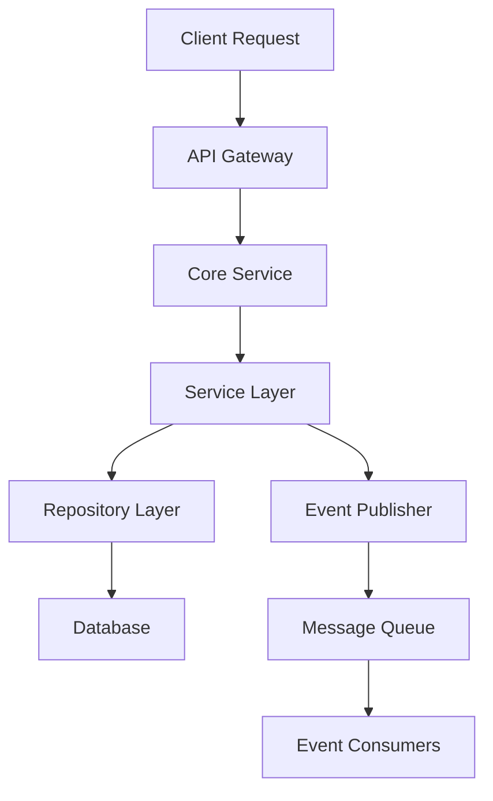

# Core Service - Tenant, User & All Management

## Overview
The Core Service provides comprehensive tenant and user management capabilities with authentication, authorization, and platform integration features.

## Architecture Components

### 5.1.1 Components
- **Users**: User lifecycle management and profile handling
- **Roles**: Role-based access control system
- **Permissions**: Fine-grained permission management
- **Service Platform**: Third-party platform integrations
- **Credential Management**: Secure credential storage and handling
- **User-Platform Bindings**: OAuth account associations
- **Internal Users Management**: Internal user operations
- **Authentication**: Multi-factor authentication and session management
- **Access Control**: RBAC + OAuth authorization

## Key Design Patterns

### 1. Repository Pattern
```python
class IUserRepository(ABC):
    @abstractmethod
    def create(self, user: User) -> User
    @abstractmethod
    def get_by_id(self, user_id: str) -> Optional[User]
    @abstractmethod
    def update(self, user: User) -> User
    @abstractmethod
    def delete(self, user_id: str) -> bool
```

### 2. Service Layer Pattern
```python
class IUserService(ABC):
    @abstractmethod
    def create_user(self, tenant_id: str, user_data: CreateUserRequest) -> User
    @abstractmethod
    def authenticate_user(self, credentials: AuthCredentials) -> AuthResult
    @abstractmethod
    def authorize_user(self, user_id: str, resource: str, action: str) -> bool
```

### 3. Factory Pattern
```python
class AuthProviderFactory:
    @staticmethod
    def create_provider(provider_type: str) -> IAuthProvider
```

### 4. Observer Pattern
```python
class UserEventPublisher:
    def publish_user_created(self, user: User)
    def publish_user_updated(self, user: User)
    def publish_user_deleted(self, user_id: str)
```

## Data Flow Architecture



## Communication Patterns

### Synchronous Communication
- **gRPC**: High-performance RPC for internal services
- **REST**: HTTP APIs for external integrations
- **GraphQL**: Flexible queries for frontend applications

### Asynchronous Communication
- **Event Sourcing**: User lifecycle events
- **Message Queues**: Background processing
- **Webhooks**: External system notifications

## Service Dependencies

```yaml
dependencies:
  internal:
    - tenant-service
    - notification-service
    - audit-service
  external:
    - postgresql
    - redis
    - kafka
    - oauth-providers
```

## Technology Stack

- **Language**: Python 3.11+
- **Framework**: FastAPI / gRPC
- **Database**: PostgreSQL
- **Cache**: Redis
- **Message Queue**: Apache Kafka
- **Authentication**: OAuth 2.0 / JWT
- **Containerization**: Docker + Kubernetes

## Performance Characteristics

- **Throughput**: 10,000+ requests/second
- **Latency**: < 100ms p99
- **Availability**: 99.9% SLA
- **Scalability**: Horizontal scaling support

## Security Features

- Multi-factor authentication (MFA)
- Role-based access control (RBAC)
- OAuth 2.0 / OpenID Connect
- JWT token management
- Password encryption (bcrypt)
- Audit logging
- Rate limiting
- Input validation and sanitization
