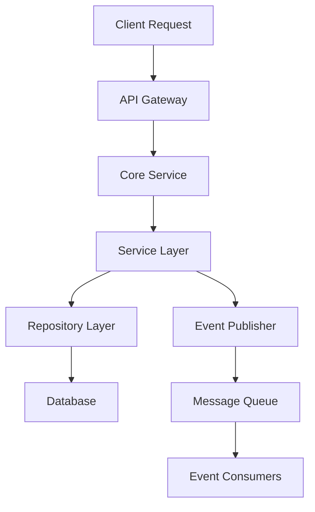

# 🧩 Core Service Documentation

This folder contains the full documentation of the **Core Service**, the foundational microservice responsible for tenant management, user identity, authentication, access control, and platform binding across the omnichannel system.

---

## 📁 Structure Overview

| Folder | Description |
|--------|-------------|
| [`api-endpoints/`](./api-endpoints/) | REST and gRPC API specifications for Core Service |
| [`communication-patterns/`](./communication-patterns/) | Internal service communication models and flows |
| [`components/`](./components/) | Detailed breakdown of Core Service modules like auth, roles, permissions, and credentials |
| [`data-models/`](./data-models/) | Entity-relationship models and schema documentation for users, roles, permissions, and platforms |

---

## 📚 Subdirectory Summaries

### 🔹 [`api-endpoints/`](./api-endpoints/)
Defines both external RESTful APIs and internal gRPC service contracts used by the Core Service. Includes:
- Swagger/OpenAPI REST specs
- gRPC service methods and security interceptors

### 🔹 [`communication-patterns/`](./communication-patterns/)
Outlines the communication architecture used within the Core Service and between other services. Covers:
- Request-Response and Event-Driven messaging
- Data flow illustrations

### 🔹 [`components/`](./components/)
Each `.md` file documents a key internal component of the Core Service:
- User Management
- Role-based Access Control (RBAC)
- Credential Management (OAuth tokens, secrets)
- Cross-platform user bindings

### 🔹 [`data-models/`](./data-models/)
Entity and relational schemas for all key tables in the Core Service database:
- Users
- Roles & Permissions
- Platform bindings (e.g., Outlook, Gmail, WhatsApp)

---

## 🧩 Integration Scope

The Core Service integrates with:
- Mail service
- Chat/WhatsApp service
- Billing, Audit, and Rate-Limit services
- Kafka for event propagation
- gRPC for secure inter-service calls

---

## 🔐 Security & Multi-Tenancy

- Fully scoped by `tenant_id` for each entity
- RBAC enforced across APIs and gRPC
- Credential management with encryption-at-rest

---

## 📌 Related Documentation

- [Monorepo Overview](../README.md)
- [Service Communication Patterns](../service-communication/README.md)
- [Diagrams](../diagrams/)

---

# 🗺️ Core Service Navigation Map

Use this visual index to quickly explore the documentation structure of the Core Service.

```mermaid
flowchart TD
    A[Core Service] --> B[API Endpoints]
    A --> C[Communication Patterns]
    A --> D[Components]
    A --> E[Data Models]

    B --> B1[REST Endpoints]
    B --> B2[gRPC Services]

    C --> C1[Request-Response]
    C --> C2[Event-Driven]
    C --> C3[Data Flow]

    D --> D1[Authentication]
    D --> D2[Access Control]
    D --> D3[Roles]
    D --> D4[Permissions]
    D --> D5[Users]
    D --> D6[Internal Users]
    D --> D7[Credential Management]
    D --> D8[User-Platform Bindings]
    D --> D9[Service Platform]

    E --> E1[User Models]
    E --> E2[Role Models]
    E --> E3[Permission Models]
    E --> E4[Platform Models]


## Architecture Components

### Components
- **Users**: User lifecycle management and profile handling
- **Roles**: Role-based access control system
- **Permissions**: Fine-grained permission management
- **Service Platform**: Third-party platform integrations
- **Credential Management**: Secure credential storage and handling
- **User-Platform Bindings**: OAuth account associations
- **Internal Users Management**: Internal user operations
- **Authentication**: Multi-factor authentication and session management
- **Access Control**: RBAC + OAuth authorization

## Key Design Patterns

### 1. Repository Pattern
```python
class IUserRepository(ABC):
    @abstractmethod
    def create(self, user: User) -> User
    @abstractmethod
    def get_by_id(self, user_id: str) -> Optional[User]
    @abstractmethod
    def update(self, user: User) -> User
    @abstractmethod
    def delete(self, user_id: str) -> bool
```

### 2. Service Layer Pattern
```python
class IUserService(ABC):
    @abstractmethod
    def create_user(self, tenant_id: str, user_data: CreateUserRequest) -> User
    @abstractmethod
    def authenticate_user(self, credentials: AuthCredentials) -> AuthResult
    @abstractmethod
    def authorize_user(self, user_id: str, resource: str, action: str) -> bool
```

### 3. Factory Pattern
```python
class AuthProviderFactory:
    @staticmethod
    def create_provider(provider_type: str) -> IAuthProvider
```

### 4. Observer Pattern
```python
class UserEventPublisher:
    def publish_user_created(self, user: User)
    def publish_user_updated(self, user: User)
    def publish_user_deleted(self, user_id: str)
```

## Data Flow Architecture



## Communication Patterns

### Synchronous Communication
- **gRPC**: High-performance RPC for internal services
- **REST**: HTTP APIs for external integrations
- **GraphQL**: Flexible queries for frontend applications

### Asynchronous Communication
- **Event Sourcing**: User lifecycle events
- **Message Queues**: Background processing
- **Webhooks**: External system notifications

## Service Dependencies

```yaml
dependencies:
  internal:
    - tenant-service
    - notification-service
    - audit-service
  external:
    - postgresql
    - redis
    - kafka
    - oauth-providers
```

## Technology Stack

- **Language**: Python 3.11+
- **Framework**: FastAPI / gRPC
- **Database**: PostgreSQL
- **Cache**: Redis
- **Message Queue**: Apache Kafka
- **Authentication**: OAuth 2.0 / JWT
- **Containerization**: Docker + Kubernetes

## Performance Characteristics

- **Throughput**: 10,000+ requests/second
- **Latency**: < 100ms p99
- **Availability**: 99.9% SLA
- **Scalability**: Horizontal scaling support

## Security Features

- Multi-factor authentication (MFA)
- Role-based access control (RBAC)
- OAuth 2.0 / OpenID Connect
- JWT token management
- Password encryption (bcrypt)
- Audit logging
- Rate limiting
- Input validation and sanitization

## 🧪 Dev Notes

- All modules follow domain-driven design
- DB schemas follow UUID-based keys
- All new APIs must be documented using the included templates

---
