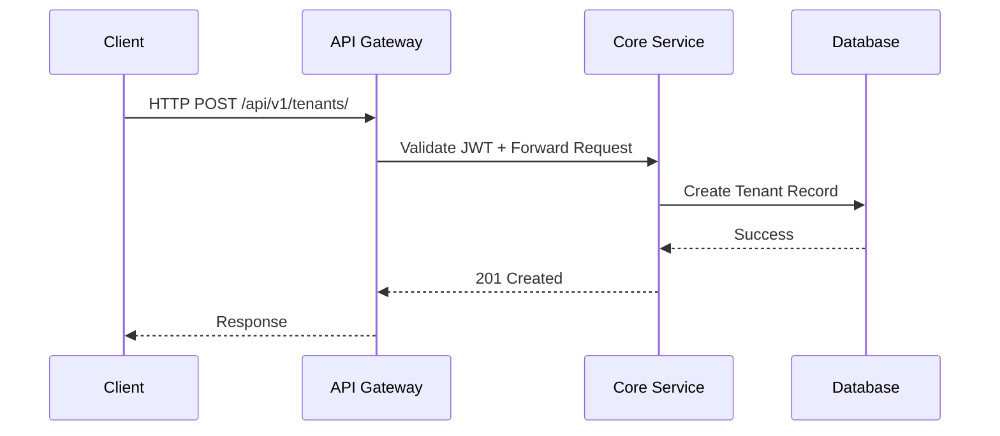
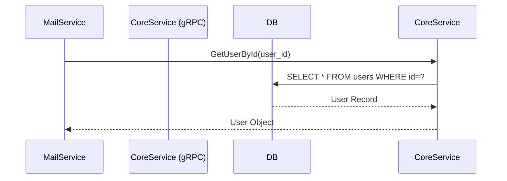

# 🌐 Core Service API Endpoints

This folder documents all **API interfaces** offered by the Core Service, enabling external clients and internal services to manage tenants, users, roles, permissions, and integrations.

---

## 📡 API Types

### [REST Endpoints](./rest-endpoints.md)
Provides public-facing endpoints following REST principles.

 JSON-based communication  
 Tenant-scoped APIs  
 Protected by OAuth2 & RBAC

**Sample Request Flow**:

 Example Endpoints:

POST /api/v1/tenants/

GET /api/v1/users/

POST /api/v1/platforms/outlook/connect/

OpenAPI docs can be auto-generated via Swagger from FastAPI or Flask.   

##gRPC Services

Used for internal service-to-service communication.

Proto definitions with strict typing
High-performance, low-latency calls
Supports metadata for secure auth

Available Services:

UserService

TenantService

RBACService

Security
All APIs are secured using:

OAuth2 for REST

JWT metadata for gRPC

RBAC middleware for route-level authorization

Tenant-level isolation

## 🧩 Related Documentation

- [Components](../components/)
- [Data Models](../data-models/)
- [Communication Patterns](../communication-patterns/)
- [Service-to-Service Communication](../../service-communication/)

---

## 📘 Notes

> This API layer is versioned under `/api/v1/` for backward compatibility and clear upgrade paths.
> 
> Internal APIs (like gRPC) follow semver tagging in `.proto` files and enforce strict contract maintenance.

