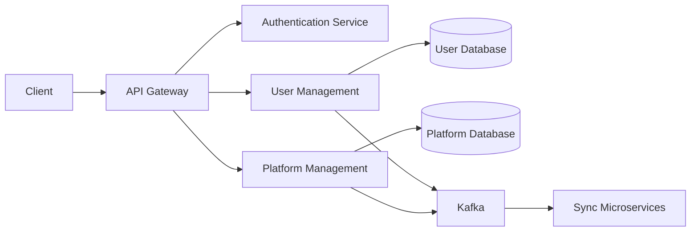

Markdown

# Data Flow in Core Service

## Overview
Data Flow describes how data moves between components and services, including storage, processing, and communication layers.

---

## Core Service Data Flow

### Description

Client sends API requests routed through the API Gateway.
Authentication Service validates requests.
User and Platform Services process requests, updating their respective databases.
Services publish events to Kafka for asynchronous downstream processing.
Sync Microservices consume events for data replication and cross-service updates.
Benefits
Clear separation of concerns
Reliable and scalable data processing
Supports multi-tenant isolation and extensibility
