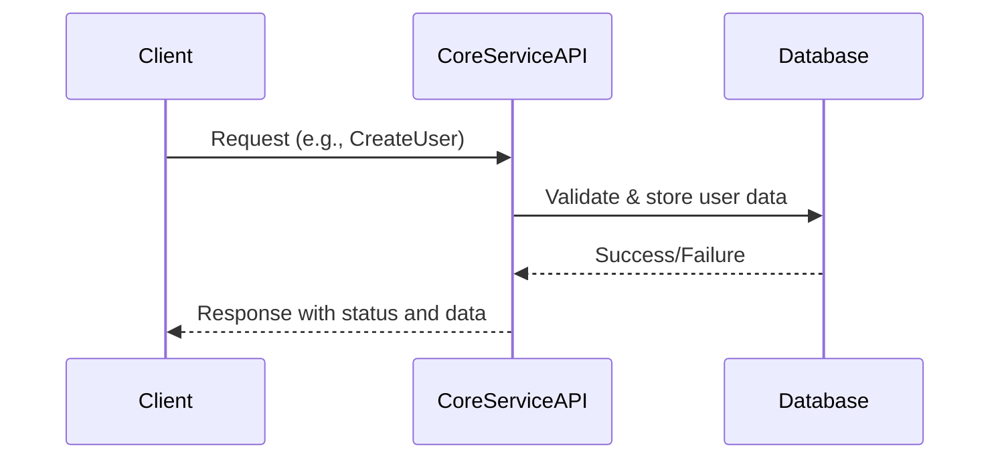

Markdown

# Request-Response Communication Pattern

## Overview
Request-Response is a **synchronous communication pattern** where a client sends a request and waits for a response from the service. It is widely used for REST APIs and gRPC calls.

---

## Usage in Core Service
* User management API calls (create, update, delete users)
* Platform configuration requests
* Authentication and authorization requests

---

## Architecture

    
Benefits
Simple and intuitive
Immediate feedback to clients
Easy error handling
Drawbacks
Blocking nature limits scalability in some use cases
Not suitable for long-running or asynchronous operations
Best Practices
Use timeouts to avoid indefinite waiting
Return meaningful error messages
Use HTTP status codes or gRPC status codes appropriately

