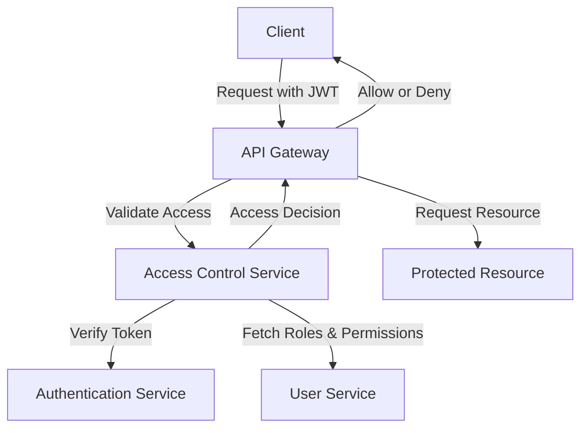

Markdown

# Access Control Component Overview

The Access Control component governs **who can access what** within the system by enforcing **Role-Based Access Control (RBAC) and Fine-Grained Permissions**. It ensures that only authorized users and services can access protected resources or perform specific actions across tenants and services. This component works closely with Authentication, Roles, and Permissions components to evaluate access policies dynamically.

---

## Responsibilities

* Enforce RBAC policies per tenant.
* Validate permissions per request.
* Integrate with API Gateway and service interceptors.
* Allow role chaining, default roles, and scoped permissions.
* Support dynamic permission checks in business logic.
* Provide admin override access (with audit logs).
* Apply scoped access on data resources (row-level security).

---

## Key Concepts

| Concept      | Description                                                    |
| :----------- | :------------------------------------------------------------- |
| **Role** | A logical grouping of permissions (e.g., admin, viewer, editor) |
| **Permission** | An atomic access rule (e.g., user:create, email:read)          |
| **Scope** | A constraint on how a permission applies (e.g., tenant-specific, self-only) |
| **Rule** | A runtime evaluation to check if access is allowed             |
| **Resource** | Any protected data entity (e.g., user, email, document)        |

---

## Access Evaluation Flow

1.  Extract JWT from request.
2.  Parse roles and permissions from claims.
3.  Match requested action to permission.
4.  Validate scope (tenant ID, resource ownership).
5.  Allow or deny access.

---

## Enforcement Methods

| Layer            | Method                                     |
| :--------------- | :----------------------------------------- |
| **API Gateway** | Role/Permission middleware                 |
| **REST Controllers** | `@require_permission` decorator            |
| **gRPC Services** | Unary/Bidirectional Interceptors           |
| **Internal Logic** | `access_control.check_permission()`          |
| **DB Access** | Row-level filters by permission            |

---
### Data Flow Diagram (DFD) for Access Control


---
### Communication Flow Diagram for Access Control Components

```mermaid
flowchart LR
    Client["Client"]
    API["API Gateway"]
    AuthService["Auth Service"]
    AccessControl["Access Control"]
    UserService["User Service"]

    Client -->|Send Request + JWT| API
    API -->|Check Permission| AccessControl
    AccessControl -->|Validate Token| AuthService
    AccessControl -->|Query Roles/Permissions| UserService
    AccessControl -->|Response (Allow/Deny)| API
    API -->|Response to Client| Client

``` 
## Decorator Example (Python)

```python
@require_permission("user:create")
def create_user(request):
    ...
Permission Check Function (Python)
Python

def check_permission(user_id: UUID, permission: str, resource_id: Optional[UUID] = None) -> bool:
    user_roles = get_user_roles(user_id)
    user_permissions = resolve_permissions(user_roles)
    if permission in user_permissions:
        return apply_scope_rules(permission, user_id, resource_id)
    return False
REST Middleware Example (Python)
Python

@app.middleware("http")
async def enforce_access_control(request, call_next):
    user = decode_jwt(request.headers["Authorization"])
    permission_required = extract_permission_metadata(request)
    if not has_permission(user, permission_required):
        raise HTTPException(status_code=403, detail="Access Denied")
    return await call_next(request)
gRPC Interceptor Example (Python)
Python

class AccessControlInterceptor(grpc.ServerInterceptor):
    def intercept_service(self, continuation, handler_call_details):
        metadata = handler_call_details.invocation_metadata
        token = extract_jwt_from_metadata(metadata)
        if not validate_permission(token, handler_call_details.method):
            raise grpc.RpcError(grpc.StatusCode.PERMISSION_DENIED)
        return continuation(handler_call_details)
Role-Based Access Example (YAML)
YAML

role: admin
permissions:
  - user:create
  - user:delete
  - email:read
  - email:send

role: viewer
permissions:
  - email:read
Permission Scopes
Scope Type	Description
Global	Permission applies system-wide
Tenant	Permission applies only within tenant
Resource Owned	Applies only to resources owned by user
Delegated	Temporary, delegated access (support mode)

Export to Sheets
Event Topics (Python)
Python

class AccessControlEvents:
    ACCESS_DENIED = "access.denied"
    ACCESS_GRANTED = "access.granted"
    PERMISSION_CHANGED = "access.permission.changed"
Monitoring & Metrics
access_granted_total
access_denied_total
permission_check_duration_ms
scoped_permission_miss_total
Audit Logging
Each access check that fails or escalates privileges is logged with:

User ID
Role(s)
Permission checked
Resource (if applicable)
Timestamp
IP address
Result (granted/denied)
Usage Example
Scenario: Delete another user's account
JWT contains:

JSON

{
  "sub": "user-123",
  "tenant_id": "tenant-xyz",
  "roles": ["admin"],
  "permissions": ["user:delete"]
}
Access control logic:

Role admin includes user:delete.
Permission is tenant-scoped.
Request is allowed if target user is in the same tenant.
Data Flow Diagram
Illustrates the flow for an access control check.

```mermaid
sequenceDiagram
    participant Client
    participant API
    participant AuthService
    participant AccessControl
    participant UserService

    Client->>API: Request (with JWT)
    API->>AccessControl: Validate Permission
    AccessControl->>AuthService: Decode & Verify Token
    AccessControl->>UserService: Get User Roles & Permissions
    AccessControl-->>API: Access Granted
    API-->>Client: Success Response
Best Practices
Always resolve permissions server-side (never trust client).
Use permission caching (e.g., Redis) for performance.
Keep permission granularity fine, roles coarser.
Always log access denials and permission escalations.
Enforce scopes early (row-level filters for DB access).
