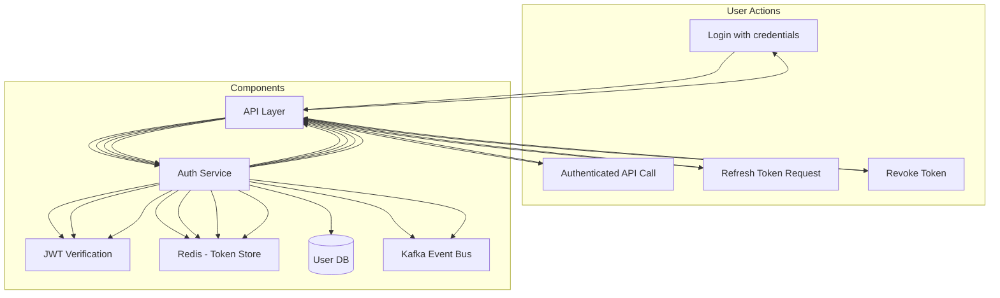

Markdown

# Authentication Component Overview

The Authentication component provides **secure, multi-tenant login and identity verification capabilities** for all users and services in the system. It supports both internal and external (platform-based) user authentication and implements standard OAuth2/OIDC flows for service integrations. This component ensures every request is properly authenticated before authorization and access control policies are applied.

---

## Responsibilities

* Handle login and token issuance (access/refresh tokens).
* Support OAuth2, password-based, and token-based authentication.
* Verify and decode JWTs.
* Support multi-tenant authentication contexts.
* Integrate with platform-specific authentication for SSO.
* Provide impersonation (with strict auditing) for support users.
* Enforce account lockout, rate limits, and MFA (if enabled).

---

## Auth Types Supported

| Type                  | Description                                |
| :-------------------- | :----------------------------------------- |
| **Password-based** | Username/email + password                  |
| **OAuth2 Platform** | Google, Microsoft, Facebook, etc.          |
| **API Tokens** | For system-to-system communication         |
| **JWT Bearer Tokens** | For authenticated API calls                |
| **Service Credentials** | Used by internal services or daemons       |

---
### Data Flow Diagram
```mermaid
flowchart TD
    subgraph Client Side
        User[User / Client]
    end

    subgraph API Layer
        API[API Gateway / REST API]
    end

    subgraph Auth Service
        Auth[AuthService]
        Redis[Redis (Rate Limits, Refresh Tokens)]
        JWT[JWT Engine (Encode/Decode)]
    end

    subgraph Database
        UserDB[(User & Tenant DB)]
    end

    User -->|Login Request (username/password)| API
    API -->|Forward to AuthService| Auth
    Auth -->|Check rate limit & lockout| Redis
    Auth -->|Lookup User in DB| UserDB
    Auth -->|Validate credentials| UserDB
    Auth -->|Generate JWT + Refresh Token| JWT
    JWT -->|Store refresh token| Redis
    Auth -->|Send token response| API
    API -->|Return Access + Refresh Token| User
```
---
### Communication Flow Diagram

---

## Interface Definitions

### IAuthService Interface

Outlines the operations for authentication at the service layer.

```python
class IAuthService(ABC):
    def login_with_password(self, request: LoginRequest) -> AuthTokenResponse
    def login_with_token(self, token: str) -> AuthTokenResponse
    def validate_token(self, token: str) -> DecodedJWT
    def refresh_token(self, refresh_token: str) -> AuthTokenResponse
    def revoke_token(self, token: str) -> bool
Data Model
LoginAttempt
Represents a record of a login attempt.

Python

@dataclass
class LoginAttempt:
    id: UUID
    user_id: UUID
    tenant_id: UUID
    method: str  # password, oauth, token
    success: bool
    timestamp: datetime
    ip_address: str
    user_agent: str
Request/Response Schemas
LoginRequest
Defines the payload for a login request.

JSON

{
  "tenant_id": "tenant-abc",
  "username": "admin_001",
  "password": "P@ssw0rd"
}
AuthTokenResponse
Defines the response containing authentication tokens.

JSON

{
  "access_token": "jwt-token",
  "refresh_token": "refresh-token",
  "expires_in": 3600,
  "token_type": "bearer"
}
API Endpoints
REST Endpoints
The RESTful API provides the following endpoints for authentication management.

YAML

POST /api/v1/auth/login:
  summary: Login using username and password
  requestBody: LoginRequest
  responses:
    200: AuthTokenResponse
    401: Unauthorized

POST /api/v1/auth/refresh:
  summary: Refresh JWT using refresh token
  requestBody:
    refresh_token: string
  responses:
    200: AuthTokenResponse
    401: Invalid or expired

POST /api/v1/auth/revoke:
  summary: Revoke access/refresh tokens
  requestBody:
    token: string
  responses:
    200: Success

GET /api/v1/auth/me:
  summary: Get current user profile from JWT
  headers:
    Authorization: Bearer token
  responses:
    200: UserProfile
    401: Unauthorized
gRPC Interface
The gRPC service defines the following methods for authentication operations.

Protocol Buffers

service AuthService {
  rpc LoginWithPassword(LoginRequest) returns (AuthTokenResponse);
  rpc ValidateToken(TokenRequest) returns (TokenValidationResponse);
  rpc RefreshToken(RefreshTokenRequest) returns (AuthTokenResponse);
  rpc RevokeToken(TokenRevokeRequest) returns (GenericResponse);
}
Token Structure
JWT Claims
Example structure of a JWT payload.

JSON

{
  "sub": "user-uuid",
  "tenant_id": "tenant-uuid",
  "roles": ["admin"],
  "permissions": ["user:read", "user:write"],
  "exp": 1712345678,
  "iat": 1712341678,
  "iss": "core-service"
}
Signed using HS256 or RS256.
Refresh tokens stored in Redis with expiration.
Access tokens are short-lived (e.g., 1 hour).
Event Topics
Python

class AuthEvents:
    LOGIN_SUCCESS = "auth.login.success"
    LOGIN_FAILED = "auth.login.failed"
    TOKEN_REVOKED = "auth.token.revoked"
    TOKEN_REFRESHED = "auth.token.refreshed"
Security Features
Passwords are hashed using bcrypt.
JWT secrets are rotated regularly.
IP-based rate limiting and user lockouts.
Optional MFA with OTP (TOTP/SMS/Email).
Device fingerprinting (optional).
Audit logs for every login and token event.
Monitoring & Metrics
auth_login_success_total
auth_login_failed_total
auth_token_issued_total
auth_token_revoked_total
Validation Rules
Password must meet complexity policy (if enforced by tenant).
Login locked after 5 failed attempts in 10 minutes.
Refresh token expiration must be validated against Redis.
JWT signature and expiry must always be verified.
Usage Examples
Login with Password
JSON

POST /api/v1/auth/login
{
  "tenant_id": "abc",
  "username": "admin_001",
  "password": "P@ssword1"
}
Response:

JSON

{
  "access_token": "...",
  "refresh_token": "...",
  "expires_in": 3600
}
Refresh Token
JSON

POST /api/v1/auth/refresh
{
  "refresh_token": "..."
}
Data Flow Diagram
Illustrates the flow for a user login.


sequenceDiagram
    participant User
    participant API
    participant AuthService
    participant Redis
    participant JWT

    User->>API: Login(username, password)
    API->>AuthService: Validate credentials
    AuthService->>Redis: Check rate limits
    AuthService->>JWT: Issue JWT & Refresh Token
    AuthService-->>API: AuthTokenResponse
    API-->>User: Access + Refresh Token
