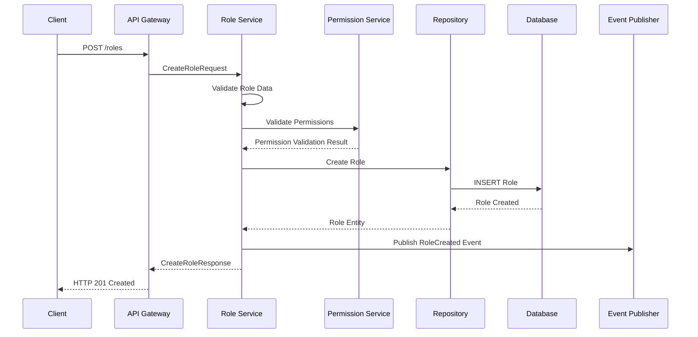
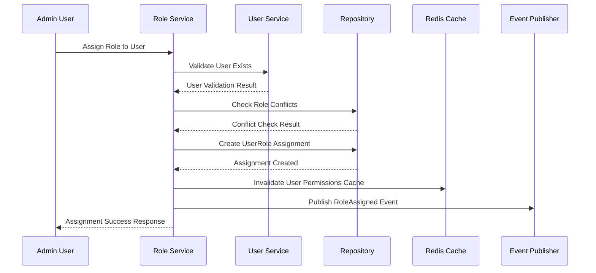
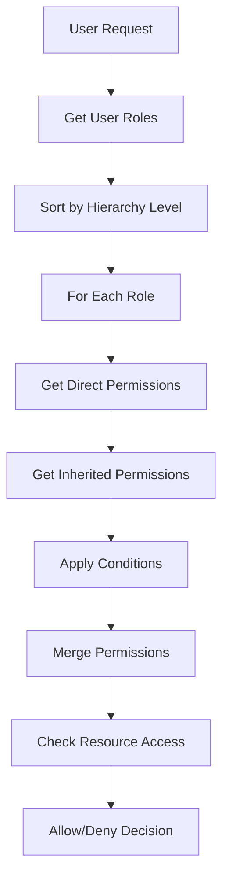

# Roles Component

## Overview
The Roles component manages role definitions, hierarchies, and assignments within the RBAC (Role-Based Access Control) system.

## Class Interfaces

### IRole Interface
```python
class IRole(ABC):
    id: UUID
    tenant_id: UUID
    name: str
    display_name: str
    description: Optional[str]
    is_system_role: bool
    is_active: bool
    hierarchy_level: int
    
    @abstractmethod
    def add_permission(self, permission: Permission) -> None
    @abstractmethod
    def remove_permission(self, permission: Permission) -> None
    @abstractmethod
    def has_permission(self, permission_name: str) -> bool
```

### IRoleService Interface
```python
class IRoleService(ABC):
    @abstractmethod
    def create_role(self, request: CreateRoleRequest) -> CreateRoleResponse
    @abstractmethod
    def get_role(self, request: GetRoleRequest) -> GetRoleResponse
    @abstractmethod
    def update_role(self, request: UpdateRoleRequest) -> UpdateRoleResponse
    @abstractmethod
    def delete_role(self, request: DeleteRoleRequest) -> DeleteRoleResponse
    @abstractmethod
    def assign_role_to_user(self, request: AssignRoleRequest) -> AssignRoleResponse
    @abstractmethod
    def revoke_role_from_user(self, request: RevokeRoleRequest) -> RevokeRoleResponse
    @abstractmethod
    def get_user_roles(self, request: GetUserRolesRequest) -> GetUserRolesResponse
```

### IRoleRepository Interface
```python
class IRoleRepository(ABC):
    @abstractmethod
    def create(self, role: Role) -> Role
    @abstractmethod
    def get_by_id(self, role_id: UUID) -> Optional[Role]
    @abstractmethod
    def get_by_name(self, name: str, tenant_id: UUID) -> Optional[Role]
    @abstractmethod
    def update(self, role: Role) -> Role
    @abstractmethod
    def delete(self, role_id: UUID) -> bool
    @abstractmethod
    def list_by_tenant(self, tenant_id: UUID) -> List[Role]
    @abstractmethod
    def get_user_roles(self, user_id: UUID) -> List[Role]
```

## Data Models

### Role Entity
```python
@dataclass
class Role:
    id: UUID
    tenant_id: UUID
    name: str
    display_name: str
    description: Optional[str] = None
    is_system_role: bool = False
    is_active: bool = True
    hierarchy_level: int = 0
    parent_role_id: Optional[UUID] = None
    permissions: List[Permission] = field(default_factory=list)
    metadata: Dict[str, Any] = field(default_factory=dict)
    created_at: datetime = field(default_factory=datetime.utcnow)
    updated_at: datetime = field(default_factory=datetime.utcnow)
```

### UserRole Entity
```python
@dataclass
class UserRole:
    id: UUID
    user_id: UUID
    role_id: UUID
    granted_by: UUID
    granted_at: datetime
    expires_at: Optional[datetime] = None
    is_active: bool = True
    conditions: Dict[str, Any] = field(default_factory=dict)
    metadata: Dict[str, Any] = field(default_factory=dict)
```

### RoleHierarchy Entity
```python
@dataclass
class RoleHierarchy:
    id: UUID
    parent_role_id: UUID
    child_role_id: UUID
    tenant_id: UUID
    inheritance_type: str = "full"  # full, partial, conditional
    conditions: Dict[str, Any] = field(default_factory=dict)
    created_at: datetime = field(default_factory=datetime.utcnow)
```

## Request/Response Models

### CreateRoleRequest
```python
@dataclass
class CreateRoleRequest:
    tenant_id: str
    name: str
    display_name: str
    description: Optional[str] = None
    permissions: List[str] = field(default_factory=list)
    parent_role_id: Optional[str] = None
    hierarchy_level: int = 0
    metadata: Dict[str, Any] = field(default_factory=dict)
```

### RoleResponse
```python
@dataclass
class RoleResponse:
    id: str
    tenant_id: str
    name: str
    display_name: str
    description: Optional[str]
    is_system_role: bool
    is_active: bool
    hierarchy_level: int
    parent_role_id: Optional[str]
    permissions: List[PermissionResponse]
    user_count: int
    created_at: str
    updated_at: str
```

### AssignRoleRequest
```python
@dataclass
class AssignRoleRequest:
    user_id: str
    role_id: str
    granted_by: str
    expires_at: Optional[str] = None
    conditions: Dict[str, Any] = field(default_factory=dict)
    metadata: Dict[str, Any] = field(default_factory=dict)
```

## Data Flow

### Role Creation Flow


### Role Assignment Flow


## API Endpoints

### REST Endpoints
```yaml
POST /api/v1/roles:
  summary: Create new role
  request_body: CreateRoleRequest
  responses:
    201: CreateRoleResponse
    400: ValidationError
    409: RoleAlreadyExists

GET /api/v1/roles/{role_id}:
  summary: Get role by ID
  responses:
    200: RoleResponse
    404: RoleNotFound

PUT /api/v1/roles/{role_id}:
  summary: Update role
  request_body: UpdateRoleRequest
  responses:
    200: RoleResponse
    404: RoleNotFound

DELETE /api/v1/roles/{role_id}:
  summary: Delete role
  responses:
    204: No Content
    404: RoleNotFound
    409: RoleInUse

POST /api/v1/roles/{role_id}/assign:
  summary: Assign role to user
  request_body: AssignRoleRequest
  responses:
    200: AssignRoleResponse
    404: RoleNotFound

DELETE /api/v1/roles/{role_id}/users/{user_id}:
  summary: Revoke role from user
  responses:
    204: No Content
    404: AssignmentNotFound

GET /api/v1/users/{user_id}/roles:
  summary: Get user roles
  responses:
    200: GetUserRolesResponse
```

### gRPC Service Definition
```protobuf
service RoleService {
  rpc CreateRole(CreateRoleRequest) returns (CreateRoleResponse);
  rpc GetRole(GetRoleRequest) returns (GetRoleResponse);
  rpc UpdateRole(UpdateRoleRequest) returns (UpdateRoleResponse);
  rpc DeleteRole(DeleteRoleRequest) returns (DeleteRoleResponse);
  rpc AssignRole(AssignRoleRequest) returns (AssignRoleResponse);
  rpc RevokeRole(RevokeRoleRequest) returns (RevokeRoleResponse);
  rpc GetUserRoles(GetUserRolesRequest) returns (GetUserRolesResponse);
  rpc GetRoleHierarchy(GetRoleHierarchyRequest) returns (GetRoleHierarchyResponse);
}
```

## Role Hierarchy System

### Hierarchy Types
```python
class HierarchyType(Enum):
    FULL_INHERITANCE = "full"
    PARTIAL_INHERITANCE = "partial"
    CONDITIONAL_INHERITANCE = "conditional"
    NO_INHERITANCE = "none"
```

### Built-in System Roles
```python
SYSTEM_ROLES = {
    "super_admin": {
        "display_name": "Super Administrator",
        "description": "Full system access",
        "hierarchy_level": 100,
        "is_system_role": True
    },
    "tenant_admin": {
        "display_name": "Tenant Administrator",
        "description": "Full tenant access",
        "hierarchy_level": 90,
        "is_system_role": True
    },
    "user_manager": {
        "display_name": "User Manager",
        "description": "User management access",
        "hierarchy_level": 70,
        "is_system_role": True
    },
    "viewer": {
        "display_name": "Viewer",
        "description": "Read-only access",
        "hierarchy_level": 10,
        "is_system_role": True
    }
}
```

## Event Definitions

### RoleEvents
```python
class RoleEvents:
    ROLE_CREATED = "role.created"
    ROLE_UPDATED = "role.updated"
    ROLE_DELETED = "role.deleted"
    ROLE_ASSIGNED = "role.assigned"
    ROLE_REVOKED = "role.revoked"
    ROLE_HIERARCHY_CHANGED = "role.hierarchy.changed"
```

### Event Schemas
```python
@dataclass
class RoleCreatedEvent:
    event_type: str = "role.created"
    timestamp: datetime
    role_id: str
    tenant_id: str
    role_name: str
    created_by: str
    permissions: List[str]

@dataclass
class RoleAssignedEvent:
    event_type: str = "role.assigned"
    timestamp: datetime
    user_id: str
    role_id: str
    tenant_id: str
    granted_by: str
    expires_at: Optional[datetime]
```

## Business Rules

### Role Creation Rules
1. Role names must be unique within tenant
2. System roles cannot be modified or deleted
3. Role hierarchy levels must be consistent
4. Parent role must exist and be active
5. Maximum hierarchy depth: 10 levels

### Role Assignment Rules
1. Users can have multiple roles
2. Role conflicts are checked during assignment
3. Temporary role assignments have expiration dates
4. Role assignments can have conditions
5. System roles require elevated privileges to assign

### Role Hierarchy Rules
1. Child roles inherit parent permissions
2. Inheritance can be full, partial, or conditional
3. Circular dependencies are prevented
4. Role hierarchy affects permission resolution order

## Permission Resolution Algorithm

### Resolution Flow


### Permission Resolution Strategy
```python
class PermissionResolver:
    def resolve_user_permissions(self, user_id: UUID) -> Set[Permission]:
        roles = self.get_user_active_roles(user_id)
        permissions = set()
        
        # Sort roles by hierarchy level (highest first)
        sorted_roles = sorted(roles, key=lambda r: r.hierarchy_level, reverse=True)
        
        for role in sorted_roles:
            # Add direct permissions
            permissions.update(role.permissions)
            
            # Add inherited permissions
            inherited = self.get_inherited_permissions(role)
            permissions.update(inherited)
            
        return permissions
```

## Caching Strategy

### Cache Keys
```python
CACHE_KEYS = {
    "user_roles": "user:{user_id}:roles",
    "user_permissions": "user:{user_id}:permissions",
    "role_permissions": "role:{role_id}:permissions",
    "role_hierarchy": "tenant:{tenant_id}:role_hierarchy"
}
```

### Cache TTL
- User roles: 30 minutes
- User permissions: 15 minutes
- Role permissions: 1 hour
- Role hierarchy: 6 hours

## Database Schema

### Indexes
```sql
-- Role indexes
CREATE INDEX idx_roles_tenant_name ON roles(tenant_id, name);
CREATE INDEX idx_roles_hierarchy ON roles(hierarchy_level);
CREATE INDEX idx_roles_active ON roles(is_active);

-- UserRole indexes
CREATE INDEX idx_user_roles_user_id ON user_roles(user_id);
CREATE INDEX idx_user_roles_role_id ON user_roles(role_id);
CREATE INDEX idx_user_roles_active ON user_roles(is_active);
CREATE INDEX idx_user_roles_expires ON user_roles(expires_at);
```

## Error Handling

### Error Types
```python
class RoleServiceError(Exception):
    pass

class RoleNotFoundError(RoleServiceError):
    pass

class RoleAlreadyExistsError(RoleServiceError):
    pass

class RoleInUseError(RoleServiceError):
    pass

class CircularHierarchyError(RoleServiceError):
    pass

class RoleAssignmentError(RoleServiceError):
    pass
```
