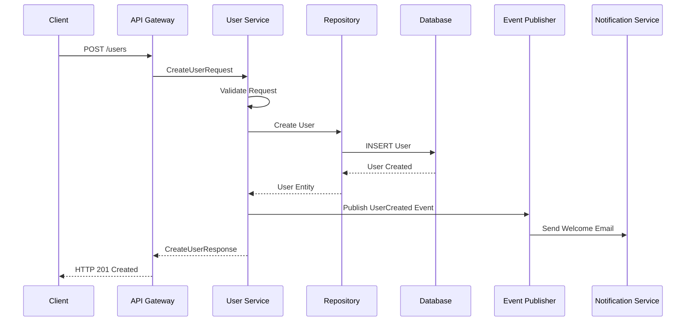
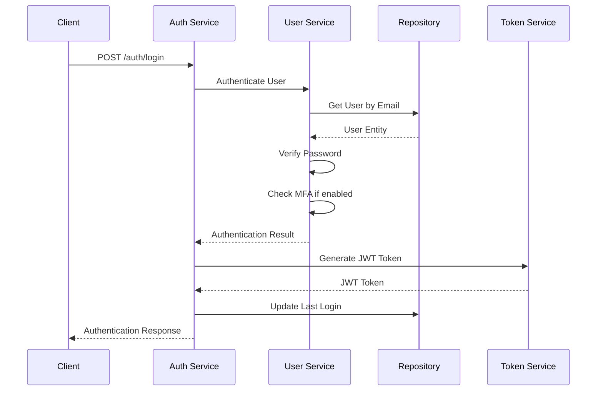

# Users Component

## Overview
The Users component handles user lifecycle management, authentication, and profile management within the multi-tenant architecture.

## Class Interfaces

### IUser Interface
```python
class IUser(ABC):
    id: UUID
    tenant_id: UUID
    email: str
    username: Optional[str]
    first_name: Optional[str]
    last_name: Optional[str]
    is_active: bool
    is_verified: bool
    created_at: datetime
    updated_at: datetime
    
    @abstractmethod
    def set_password(self, password: str) -> None
    @abstractmethod
    def check_password(self, password: str) -> bool
    @abstractmethod
    def to_dict(self) -> Dict[str, Any]
```

### IUserService Interface
```python
class IUserService(ABC):
    @abstractmethod
    def create_user(self, request: CreateUserRequest) -> CreateUserResponse
    @abstractmethod
    def get_user(self, request: GetUserRequest) -> GetUserResponse
    @abstractmethod
    def update_user(self, request: UpdateUserRequest) -> UpdateUserResponse
    @abstractmethod
    def delete_user(self, request: DeleteUserRequest) -> DeleteUserResponse
    @abstractmethod
    def list_users(self, request: ListUsersRequest) -> ListUsersResponse
    @abstractmethod
    def verify_user(self, request: VerifyUserRequest) -> VerifyUserResponse
```

### IUserRepository Interface
```python
class IUserRepository(ABC):
    @abstractmethod
    def create(self, user: User) -> User
    @abstractmethod
    def get_by_id(self, user_id: UUID) -> Optional[User]
    @abstractmethod
    def get_by_email(self, email: str, tenant_id: UUID) -> Optional[User]
    @abstractmethod
    def update(self, user: User) -> User
    @abstractmethod
    def delete(self, user_id: UUID) -> bool
    @abstractmethod
    def list_by_tenant(self, tenant_id: UUID, filters: UserFilters) -> List[User]
```

## Data Models

### User Entity
```python
@dataclass
class User:
    id: UUID
    tenant_id: UUID
    email: str
    username: Optional[str] = None
    password_hash: Optional[str] = None
    first_name: Optional[str] = None
    last_name: Optional[str] = None
    phone: Optional[str] = None
    avatar_url: Optional[str] = None
    is_active: bool = True
    is_verified: bool = False
    is_internal: bool = False
    last_login: Optional[datetime] = None
    login_attempts: int = 0
    locked_until: Optional[datetime] = None
    mfa_enabled: bool = False
    mfa_secret: Optional[str] = None
    backup_codes: List[str] = field(default_factory=list)
    metadata: Dict[str, Any] = field(default_factory=dict)
    created_at: datetime = field(default_factory=datetime.utcnow)
    updated_at: datetime = field(default_factory=datetime.utcnow)
```

### UserProfile Entity
```python
@dataclass
class UserProfile:
    id: UUID
    user_id: UUID
    bio: Optional[str] = None
    location: Optional[str] = None
    timezone: str = 'UTC'
    language: str = 'en'
    preferences: Dict[str, Any] = field(default_factory=dict)
    social_links: Dict[str, str] = field(default_factory=dict)
    created_at: datetime = field(default_factory=datetime.utcnow)
    updated_at: datetime = field(default_factory=datetime.utcnow)
```

## Request/Response Models

### CreateUserRequest
```python
@dataclass
class CreateUserRequest:
    tenant_id: str
    email: str
    password: Optional[str] = None
    username: Optional[str] = None
    first_name: Optional[str] = None
    last_name: Optional[str] = None
    phone: Optional[str] = None
    is_internal: bool = False
    metadata: Dict[str, Any] = field(default_factory=dict)
    profile: Optional[UserProfileRequest] = None
```

### CreateUserResponse
```python
@dataclass
class CreateUserResponse:
    user: UserResponse
    success: bool
    message: str
    verification_token: Optional[str] = None
```

### UserResponse
```python
@dataclass
class UserResponse:
    id: str
    tenant_id: str
    email: str
    username: Optional[str]
    first_name: Optional[str]
    last_name: Optional[str]
    phone: Optional[str]
    avatar_url: Optional[str]
    is_active: bool
    is_verified: bool
    is_internal: bool
    last_login: Optional[str]
    mfa_enabled: bool
    created_at: str
    updated_at: str
    profile: Optional[UserProfileResponse] = None
```

## Data Flow

### User Creation Flow


### User Authentication Flow


## API Endpoints

### REST Endpoints
```yaml
POST /api/v1/users:
  summary: Create new user
  request_body: CreateUserRequest
  responses:
    201: CreateUserResponse
    400: ValidationError
    409: UserAlreadyExists

GET /api/v1/users/{user_id}:
  summary: Get user by ID
  parameters:
    - user_id: string (UUID)
  responses:
    200: UserResponse
    404: UserNotFound

PUT /api/v1/users/{user_id}:
  summary: Update user
  request_body: UpdateUserRequest
  responses:
    200: UserResponse
    404: UserNotFound
    400: ValidationError

DELETE /api/v1/users/{user_id}:
  summary: Delete user
  responses:
    204: No Content
    404: UserNotFound

GET /api/v1/users:
  summary: List users
  parameters:
    - tenant_id: string (UUID)
    - page: integer
    - per_page: integer
    - filters: UserFilters
  responses:
    200: ListUsersResponse
```

### gRPC Service Definition
```protobuf
service UserService {
  rpc CreateUser(CreateUserRequest) returns (CreateUserResponse);
  rpc GetUser(GetUserRequest) returns (GetUserResponse);
  rpc UpdateUser(UpdateUserRequest) returns (UpdateUserResponse);
  rpc DeleteUser(DeleteUserRequest) returns (DeleteUserResponse);
  rpc ListUsers(ListUsersRequest) returns (ListUsersResponse);
  rpc VerifyUser(VerifyUserRequest) returns (VerifyUserResponse);
}
```

## Event Definitions

### UserEvents
```python
class UserEvents:
    USER_CREATED = "user.created"
    USER_UPDATED = "user.updated"
    USER_DELETED = "user.deleted"
    USER_VERIFIED = "user.verified"
    USER_LOGGED_IN = "user.logged_in"
    USER_LOCKED = "user.locked"
    USER_UNLOCKED = "user.unlocked"
```

### Event Schemas
```python
@dataclass
class UserCreatedEvent:
    event_type: str = "user.created"
    timestamp: datetime
    user_id: str
    tenant_id: str
    email: str
    is_internal: bool
    metadata: Dict[str, Any]

@dataclass
class UserUpdatedEvent:
    event_type: str = "user.updated"
    timestamp: datetime
    user_id: str
    tenant_id: str
    changes: Dict[str, Any]
    updated_by: str
```

## Business Rules

### User Creation Rules
1. Email must be unique within tenant
2. Username must be unique globally (if provided)
3. Password must meet complexity requirements
4. Internal users bypass email verification
5. External users require email verification
6. Maximum users per tenant based on subscription

### User Authentication Rules
1. Account lockout after 5 failed attempts
2. Lockout duration: 30 minutes
3. MFA required for admin users
4. Session timeout: 24 hours
5. Password expiry: 90 days (configurable)

## Error Handling

### Error Types
```python
class UserServiceError(Exception):
    pass

class UserNotFoundError(UserServiceError):
    pass

class UserAlreadyExistsError(UserServiceError):
    pass

class InvalidCredentialsError(UserServiceError):
    pass

class AccountLockedError(UserServiceError):
    pass

class MFARequiredError(UserServiceError):
    pass
```

## Performance Considerations

### Caching Strategy
- User profile data: Redis cache (TTL: 1 hour)
- User permissions: Redis cache (TTL: 30 minutes)
- Login attempts: Redis cache (TTL: 30 minutes)

### Database Indexing
```sql
-- Primary indexes
CREATE INDEX idx_users_tenant_email ON users(tenant_id, email);
CREATE INDEX idx_users_username ON users(username);
CREATE INDEX idx_users_tenant_active ON users(tenant_id, is_active);

-- Performance indexes
CREATE INDEX idx_users_last_login ON users(last_login);
CREATE INDEX idx_users_created_at ON users(created_at);
```

### Pagination
- Default page size: 20
- Maximum page size: 100
- Cursor-based pagination for large datasets
