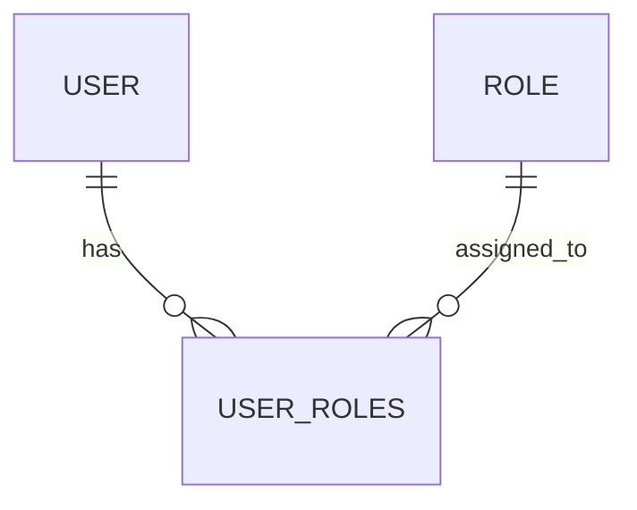

Markdown

# Role Models Overview

Roles define a collection of permissions that represent access levels within a specific tenant. This **role-based access control (RBAC)** mechanism allows for flexible and scalable security management across users and services.

---

## Data Model: `roles`

| Field          | Type                     | Description                              |
| :------------- | :----------------------- | :--------------------------------------- |
| `id`           | UUID (PK)                | Primary identifier                       |
| `tenant_id`    | UUID (FK)                | Belongs to a tenant                      |
| `name`         | String                   | Role name, e.g., `admin`, `viewer`, `billing-admin` |
| `description`  | String (nullable)        | Optional description for UI or auditing  |
| `is_system`    | Boolean                  | If true, role is reserved (e.g., default admin) |
| `created_at`   | Timestamp                | Record creation timestamp                |
| `updated_at`   | Timestamp                | Auto-updated timestamp                   |

---

## Data Model: `user_roles`

| Field         | Type                     | Description                           |
| :------------ | :----------------------- | :------------------------------------ |
| `id`          | UUID (PK)                | Unique identifier                     |
| `user_id`     | UUID (FK)                | The user assigned this role           |
| `role_id`     | UUID (FK)                | The role being assigned               |
| `assigned_by` | UUID (FK)                | ID of internal user who assigned role |
| `assigned_at` | Timestamp                | When the role was assigned            |

---

## Relationships

Illustrates the many-to-many relationship between users and roles.

Many-to-many: A user can have multiple roles, and a role can be assigned to multiple users.
Each role is scoped to a tenant (tenant_id).
System Roles
Role	Description
admin	Full access to all services and resources
viewer	Read-only access
support	Access to limited operational endpoints
billing	View or manage billing-related information

Export to Sheets
System roles are reserved and may be enforced by core-service logic.

Example: Role Record
JSON

{
  "id": "bb78e206-d9d2-47b3-8884-b238624d1241",
  "tenant_id": "df924d02-743f-4c9d-a9ab-2d0e6230b9cc",
  "name": "admin",
  "description": "Tenant administrator role",
  "is_system": true
}
Example: User Role Assignment
JSON

{
  "id": "ab46ee6f-4e25-4f85-91e0-9b2a63de477f",
  "user_id": "a6b14f2d-6e30-4a3f-babc-8fe44c178910",
  "role_id": "bb78e206-d9d2-47b3-8884-b238624d1241",
  "assigned_by": "c2df1d48-7773-49c2-826b-f1c1ef010292",
  "assigned_at": "2025-05-29T14:32:00Z"
}
Best Practices
Roles should be tenant-scoped and not reused across tenants.
Admins should be able to create custom roles with configurable permissions.
Avoid hardcoding role logic in services—use permissions instead.
Indexing & Optimization
Composite index on (tenant_id, name).
Unique constraint on (tenant_id, name).
Index on user_id and role_id for join efficiency.
