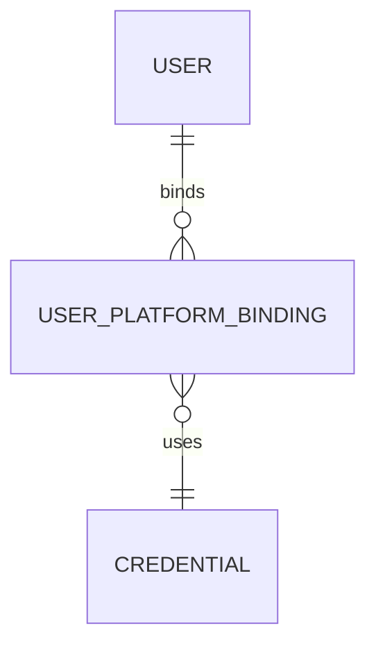

Markdown

# User Models Overview

This document defines the structure, behavior, and relationships of **user-related models** in the core-service. Users are central entities representing authenticated identities within a specific tenant, with optional bindings to platform-specific credentials (e.g., Microsoft, Google).

---

## Data Model: `users`

| Field         | Type                   | Description                                    |
| :------------ | :--------------------- | :--------------------------------------------- |
| `id`          | UUID (PK)              | Primary identifier                             |
| `tenant_id`   | UUID (FK)              | Belongs to a tenant                            |
| `email`       | String (unique)        | Primary email for login and identity           |
| `full_name`   | String                 | Full name of the user                          |
| `phone`       | String (nullable)      | Optional phone number                          |
| `is_active`   | Boolean                | Soft-delete indicator                          |
| `is_internal` | Boolean                | Whether user is a system-internal operator/admin |
| `created_at`  | Timestamp              | Auto-generated timestamp                       |
| `updated_at`  | Timestamp              | Auto-updated timestamp                         |
| `metadata`    | JSONB                  | Custom fields or user preferences              |

---

## Data Model: `user_platform_bindings`

| Field              | Type                 | Description                                      |
| :----------------- | :------------------- | :----------------------------------------------- |
| `id`               | UUID (PK)            | Unique binding identifier                        |
| `user_id`          | UUID (FK)            | References user                                  |
| `platform`         | Enum                 | E.g., `google`, `microsoft`, `whatsapp`, etc.  |
| `platform_user_id` | String               | External platform user ID                        |
| `credential_id`    | UUID (FK)            | Optional binding to credential object            |
| `scopes`           | JSON/Array           | Platform-specific scopes (e.g., `["read", "send"]`) |
| `last_synced_at`   | Timestamp            | Timestamp of last sync with platform             |
| `created_at`       | Timestamp            | Timestamp of record creation                     |

---

## Behavior

* **Platform Binding**: A user can be linked to multiple platforms. The same user across Gmail and Outlook would have multiple bindings. Each binding is isolated by `tenant_id`.
* **Scopes**: Scopes define access levels like `read:email`, `send:email`, `read:contacts`. Used by OAuth providers to authorize access.
* **Internal Users**: Used for bots, system administrators, or integrations. Distinguished using `is_internal = true`.

---

## Relationships

Illustrates the relationships between user-related entities.

Example: User Record
JSON

{
  "id": "a6b14f2d-6e30-4a3f-babc-8fe44c178910",
  "tenant_id": "b3e98c14-0f4e-4d8e-bdc7-2dd5b3401111",
  "email": "alice@acme.com",
  "full_name": "Alice Smith",
  "is_active": true,
  "is_internal": false,
  "metadata": {
    "timezone": "America/New_York"
  }
}
Example: User Platform Binding
JSON

{
  "id": "40e56dfc-d3b7-44d4-9ac5-23a3a8b0d514",
  "user_id": "a6b14f2d-6e30-4a3f-babc-8fe44c178910",
  "platform": "microsoft",
  "platform_user_id": "john.doe@outlook.com",
  "scopes": ["read:mail", "send:mail"],
  "credential_id": "f97e0dd4-6a2b-41f9-91a0-b81a84187aa1"
}
Indexes & Optimization
Index email, tenant_id, platform_user_id.
Composite unique: (tenant_id, email).
Use GIN index for metadata and scopes fields.
Security Notes
Never store platform tokens directly on the user.
Bind tokens via credential model with encryption.
Enforce per-tenant row-level filters in all queries.
